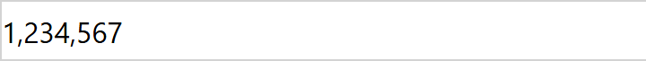
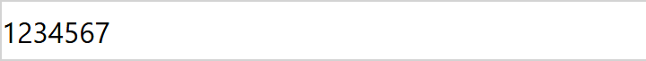

# Number Format: how to use it

A field control for model-driven apps that shows a Whole Number column with the
thousands separator you choose for that column. Each column you put it on gets
its own setting, so one form can show `1234567` next to `1,234,567`.

| Setting on the column | What 1234567 looks like |
|---|---|
| Thousands separator = **User settings** (default) |  |
| Thousands separator = **None** |  |
| Thousands separator = **Custom text**, Custom separator = `🍕` |  |

The control is display only. The value stays editable in the stock control, and
sorting and filtering in views keep using the raw number.

## 1. Get it into your environment

Either import the solution zip from a release, or build and push from source:

```powershell
cd NumberFormat
npm install
pac auth create --environment https://<your-org>.crm.dynamics.com
pac pcf push --publisher-prefix <your-prefix>
```

After the push, the control appears in the environment as
`<prefix>_KK.NumberFormat`.

## 2. Put it on a form column

1. Open the form in the form designer (make.powerapps.com, Tables, your table,
   Forms).
2. Select the Whole Number column on the form.
3. In the properties pane on the right, expand **Components** and choose
   **Get more components**.
4. Pick **Number Format** from the list and add it.
5. Set the two properties for this column:

   | Property | Values | Meaning |
   |---|---|---|
   | **Thousands separator** | User settings, None, Custom text | User settings follows the digit grouping in the user's Personalization Settings. None shows plain digits. Custom text uses the text below. |
   | **Custom separator** | any text | Placed between digit groups when Thousands separator is Custom text. A space, a thin space, an apostrophe, or an emoji all work. |

6. Save and publish the form.

Repeat on any other Whole Number column with a different setting. The setting
belongs to that placement, not to the control.

## 3. Digit grouping

Group sizes come from the user's number format, so a user with Indian grouping
sees `12,34,567` in User settings mode and `12🍕34🍕567` in Custom text mode.
Negative numbers keep a leading minus: `-1 234 567`.

## Not supported yet

- **Views.** The control is a field control; it renders on forms only. Per
  column formatting in the Power Apps grid needs a grid customizer control, which
  is on the list.
- **Editing.** The control does not accept input. Put the stock control next to
  it, or on another tab, if users need to change the value.
- **Prefix, suffix, zero padding.** Not implemented.

## Build from source

```powershell
cd NumberFormat
npm install
npm run build          # out/controls/NumberFormat
npm start              # PCF test harness in a browser
```

The `e2e/` folder holds Playwright scripts that host the harness headlessly and
screenshot the three modes, plus a script that sets up a fixture form in a
Dataverse environment. See the root README.
