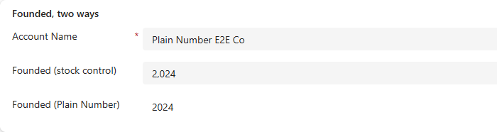
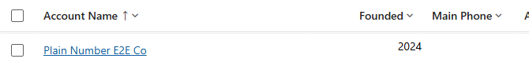

# Plain Number: how to use it

A field control for model-driven apps that shows a Whole Number column without
a thousands separator. Made for years: a column that holds `2024` should read
2024, not 2,024. No configuration.

The same column, Founded = 2024, on one form with the stock control and with
Plain Number:



Users can type into it. Whatever they type, digits are kept and everything else
is dropped, so `1,999`, `1 999` and `1999` all commit as 1999. After typing 1999
into Plain Number and pressing Enter, the stock control on the same form follows:


In the PCF test harness, mid-typing and after commit:

| While typing | After Enter or leaving the field |
|---|---|
|  |  |

Escape restores the last saved value. Empty commits a blank. Text with no
digits at all is ignored and the previous value comes back.

## 1. Get it into your environment

Import the solution zip from a release, or build and push from source:

```powershell
cd PlainNumber
npm install
pac auth create --environment https://<your-org>.crm.dynamics.com
pac pcf push --publisher-prefix <your-prefix>
```

After the push the control appears in the environment as
`<prefix>_KK.PlainNumber`.

## 2. Put it on a form column

1. Open the form in the form designer (make.powerapps.com, Tables, your table,
   Forms).
2. Select the Whole Number column on the form.
3. In the properties pane on the right, expand **Components** and choose
   **Get more components**.
4. Pick **Plain Number** and add it. There is nothing to configure.
5. Save and publish the form.

The column keeps its type, its min and max, and its business rules. Only the
rendering changes.

## 3. Views: Plain Number Grid

A view cannot carry a field control on a column, so the same package ships a
second control, **Plain Number Grid**, a customizer for the Power Apps grid
control. It has no settings. It renders plain exactly the whole-number columns
that carry Plain Number on one of the table's main forms, so the form is the one
place where you decide.



To turn it on for a table:

1. Open the classic solution explorer (make.powerapps.com, Solutions, your
   solution, the table, then **Switch to classic** if needed).
2. On the table, open the **Controls** tab.
3. **Add Control**, choose **Power Apps grid control**, and select it for Web,
   Phone and Tablet.
4. In its properties, set **Customizer control** to
   `<prefix>_KK.PlainNumberGrid`.
5. Save and publish.

Every view and subgrid of that table now shows Plain Number columns without a
separator. Other whole-number columns on the table keep the user's format.
Sorting and filtering are untouched; only the rendered text changes.

Only one customizer can be assigned per table. If the table already has one,
the two would have to be merged; see the root README.

## Build from source

```powershell
cd PlainNumber          # the form control; same for PlainNumberGrid
npm install
npm run build          # out/controls/PlainNumber
npm start              # PCF test harness in a browser
pac pcf push --publisher-prefix <your-prefix>
```

`e2e/` holds Playwright scripts that host the harness headlessly and take the
screenshots above, plus a script that builds a fixture form in a Dataverse
environment and checks that typing into Plain Number updates the record.
