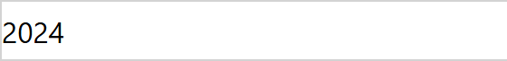

# Plain Number: how to use it

A field control for model-driven apps that shows a Whole Number column without
a thousands separator. Made for years: a column that holds `2024` should read
2024, not 2,024. No configuration.

| | Stock Whole Number control | Plain Number |
|---|---|---|
| Founded = 2024 | `2,024` |  |

Users can type into it. Whatever they type, digits are kept and everything else
is dropped, so `1,999`, `1 999` and `1999` all commit as 1999:

| While typing | After Enter or leaving the field |
|---|---|
|  |  |

Escape restores the last saved value. Empty commits a blank. Text with no
digits at all is ignored and the previous value comes back.

## 1. Get it into your environment

Import the solution zip from a release, or build and push from source:

```powershell
cd PlainNumber
npm install
pac auth create --environment https://<your-org>.crm.dynamics.com
pac pcf push --publisher-prefix <your-prefix>
```

After the push the control appears in the environment as
`<prefix>_KK.PlainNumber`.

## 2. Put it on a form column

1. Open the form in the form designer (make.powerapps.com, Tables, your table,
   Forms).
2. Select the Whole Number column on the form.
3. In the properties pane on the right, expand **Components** and choose
   **Get more components**.
4. Pick **Plain Number** and add it. There is nothing to configure.
5. Save and publish the form.

The column keeps its type, its min and max, and its business rules. Only the
rendering changes.

## Views

Not covered yet. In a view the platform still renders the column with the
user's digit grouping. See the root README for where that discussion stands.

## Build from source

```powershell
cd PlainNumber
npm install
npm run build          # out/controls/PlainNumber
npm start              # PCF test harness in a browser
```

`e2e/` holds Playwright scripts that host the harness headlessly and take the
screenshots above, plus a script that builds a fixture form in a Dataverse
environment and checks that typing into Plain Number updates the record.
